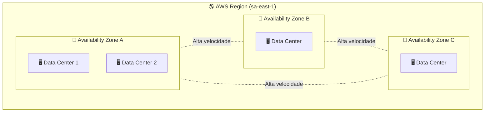

# Infraestrutura Global: Regiões e AZs

Para ser aprovado na **CLF-C02**, você precisa entender que a "nuvem" não é um lugar etéreo.

Ela é composta por hardware pesado espalhado estrategicamente pelo planeta.

A AWS não joga data centers no mapa aleatoriamente; existe uma hierarquia física projetada para que sua aplicação continue funcionando mesmo que um prédio inteiro fique indisponível.

---

## 1. Região (*AWS Region*)

Uma **AWS Region** é uma **localização geográfica isolada** onde a AWS disponibiliza sua infraestrutura.

Pense em um grande conjunto de recursos localizado em uma área específica, como:

- 🇧🇷 São Paulo (`sa-east-1`)
- 🇺🇸 Virgínia (`us-east-1`)
- 🇯🇵 Tóquio (`ap-northeast-1`)

Cada Região funciona de forma independente das demais.

---

## Os 4 Critérios para Escolher uma Região

Na prova, sempre que perguntarem **"Como escolher uma Região AWS?"**, lembre destes quatro fatores.

---

### 1️⃣ Conformidade (*Compliance*)

Algumas legislações exigem que os dados permaneçam dentro de um país ou região.

Exemplos:

- LGPD (Brasil)
- GDPR (Europa)

Se existir exigência legal sobre onde armazenar os dados, esse costuma ser o principal critério.

---

### 2️⃣ Proximidade (*Latency*)

Escolha a Região mais próxima dos seus usuários.

Exemplo:

- Usuários brasileiros → `sa-east-1` (São Paulo)
- Usuários japoneses → `ap-northeast-1` (Tóquio)

Quanto menor a distância física, menor a latência.

---

### 3️⃣ Disponibilidade de Serviços

Nem todos os serviços ou funcionalidades da AWS chegam simultaneamente em todas as Regiões.

Alguns recursos novos (principalmente IA e Machine Learning) costumam aparecer primeiro em regiões como:

- `us-east-1`
- `us-west-2`

Antes de definir uma Região, confirme que o serviço desejado está disponível nela.

---

### 4️⃣ Custo

Os preços variam entre as Regiões.

Isso acontece por fatores como:

- impostos;
- custo de energia;
- infraestrutura local.

Em geral:

- 🇺🇸 Virgínia → costuma ser mais barata;
- 🇧🇷 São Paulo → costuma ser mais cara.

---

## 2. Zona de Disponibilidade (*Availability Zone - AZ*)

Dentro de cada Região existem várias **Availability Zones (AZs)**.

Cada AZ representa **um ou mais data centers físicos**.

Esses data centers possuem:

- energia independente;
- rede independente;
- refrigeração própria;
- conectividade redundante.

---

### Isolamento

As AZs ficam separadas fisicamente por quilômetros de distância.

Isso evita que um desastre local afete todas ao mesmo tempo.

Exemplos:

- incêndio;
- enchente;
- queda de energia;
- rompimento de fibra.

---

### Conectividade

Mesmo estando fisicamente separadas, as AZs são conectadas por fibras ópticas de altíssima velocidade.

Na prática:

- a comunicação possui baixa latência;
- para sua aplicação parece que tudo está "lado a lado".

---

### Visão da Infraestrutura

---

## 3. O Poder do Multi-AZ

Aqui é onde você ganha o jogo. Esse é um dos conceitos mais importantes da certificação.

A AWS incentiva arquiteturas preparadas para falhas.

---

### Alta Disponibilidade (*High Availability*)

Consiste em distribuir os recursos por **duas ou mais AZs**.

Exemplo:

- EC2 em `sa-east-1a`
- EC2 em `sa-east-1b`

Se uma AZ ficar indisponível, a outra continua atendendo os usuários.

Resultado:

- menos indisponibilidade;
- maior confiabilidade.

---

### Tolerância a Falhas (*Fault Tolerance*)

É a capacidade da aplicação continuar funcionando mesmo após a perda de um componente crítico.

Por exemplo:

- um data center inteiro;
- uma AZ completa.

O objetivo é que o usuário nem perceba a falha.

---

## 🚨 Pegadinha de Prova

**Multi-AZ** protege contra problemas locais, como:

- incêndio;
- queda de energia;
- falha de rede;
- rompimento de fibra.

Mas...

Se a questão mencionar um desastre que afete uma Região inteira (estado, país ou grande área geográfica), a resposta deixa de ser **Multi-AZ** e passa a ser:

> **Multi-Region**

---

## 4. Cenário Prático

### Problema

Sua aplicação roda na ***região*** `sa-east-1`. Você possui `10 instâncias EC2` mas todas estão em `sa-east-1a`

---

### O risco

Se essa AZ sofrer uma indisponibilidade:

- queda de energia;
- incêndio;
- rompimento de fibra;

toda a aplicação ficará indisponível.

---

### A solução

Configure o **Auto Scaling Group** para distribuir as instâncias.

Exemplo:

- 5 instâncias em `sa-east-1a`
- 5 instâncias em `sa-east-1b`

Agora sua aplicação possui uma arquitetura resiliente.

---

## 🎯 Gatilho de Exame

Associe rapidamente os termos abaixo:

| Termo | O que significa |
|--------|-----------------|
| **AWS Region** | Área geográfica isolada (*Isolated geographic area*). |
| **Availability Zone (AZ)** | Data centers redundantes com energia e rede independentes. |
| **Low Latency Links** | Conexões de alta velocidade entre AZs da mesma Região. |
| **High Availability** | Uso de múltiplas AZs para evitar indisponibilidade. |
| **Fault Tolerance** | Capacidade do sistema continuar operando mesmo após falhas graves. |
| **Data Residency** | Escolha da Região baseada em requisitos legais e de conformidade. |

---

## 🚨 Sinal de Alerta

Se a questão falar em:

- usuários espalhados pelo mundo;
- entrega rápida de conteúdo;
- redução de latência global;

não pense apenas em **Regiões**.

Muito provavelmente a resposta envolve:

> **Edge Locations (Pontos de Presença)**

Esse é o próximo conceito importante da infraestrutura global da AWS.

---

### 🧭 Navegação de Conteúdos
* [🏠 Menu Principal](../README.md)
* [⬅️ Benefícios da Nuvem: Agilidade e Economia de Escala](01-beneficios-agilidade-economia-escala.md)
* [➡️ Edge Locations e Amazon CloudFront](03-edge-locations-e-cloudfront-cache.md)

---
---