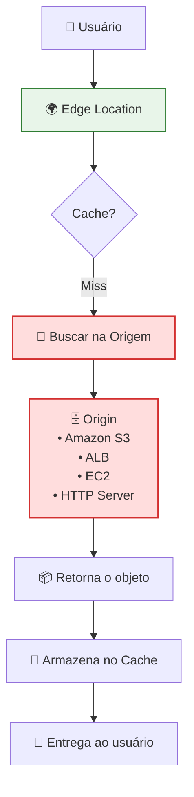
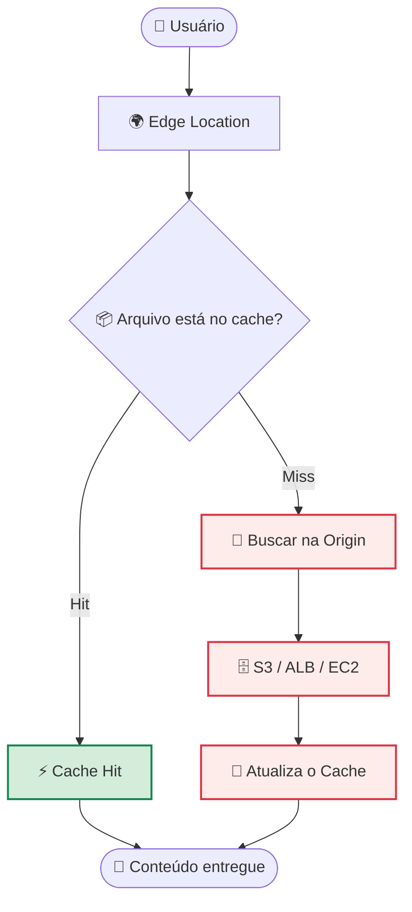

# 🌎 Edge Locations e Amazon CloudFront

Você já aprendeu que a infraestrutura global da AWS é composta por **Regiões** e **Availability Zones (AZs)**.

Mas existe uma terceira camada extremamente importante:

> **Edge Locations**

São elas que permitem entregar conteúdo para usuários do outro lado do mundo com baixa latência.

Pense nelas como a "última parada" antes do usuário final.

---

## 1. O que são Edge Locations?

As **Edge Locations** (Pontos de Presença) são pequenas unidades da infraestrutura global da AWS distribuídas por centenas de cidades ao redor do mundo.

Elas **não** são data centers completos como uma Região. 

Seu objetivo principal é:

- aproximar o conteúdo dos usuários;
- reduzir a latência;
- acelerar a entrega de dados.

Imagine um cache localizado praticamente "na esquina" da casa do usuário.

---

### O que NÃO roda em uma Edge Location?

Você **não** cria recursos como:

- EC2;
- RDS;
- EKS;
- bancos de dados;
- aplicações completas.

Esses recursos continuam sendo executados dentro das **Regiões AWS**.

As Edge Locations existem para serviços de borda (*Edge Services*).

---

## 2. Amazon CloudFront: A CDN Global da AWS

O **Amazon CloudFront** é o serviço de **CDN (Content Delivery Network)** da AWS.

Ele utiliza as Edge Locations para distribuir conteúdo pelo mundo inteiro.

O CloudFront é capaz de acelerar a entrega de:

- imagens;
- vídeos;
- arquivos HTML;
- CSS;
- JavaScript;
- downloads;
- APIs;
- conteúdo dinâmico.

> Tudo isso com menor latência.

---

### Como funciona?

Quando você configura o CloudFront, cria uma:

> **Distribution**

Essa distribuição recebe um endereço próprio. A partir desse momento:

O usuário deixa de acessar diretamente o servidor de origem. Agora o tráfego passa primeiro pela rede global da AWS.

---

## 3. Como Funciona o Cache?

Esse fluxo aparece frequentemente na certificação.

Imagine que um usuário solicita o arquivo:

```text
logo.png
```

---

### Primeira Requisição (*Cache Miss*)



---

### Próximas Requisições (*Cache Hit*)

Outro usuário solicita o mesmo arquivo.

Agora:

- o CloudFront encontra o arquivo no cache;
- entrega imediatamente;
- não precisa consultar a origem.

Esse cenário chama-se:

> **Cache Hit**

---

### Fluxo Simplificado



---

### Benefícios do CloudFront

#### ⚡ Baixa Latência

O conteúdo fica muito mais próximo do usuário.

Em vez de atravessar continentes, os dados percorrem apenas alguns quilômetros.

---

#### 💰 Economia de Banda

A origem deixa de responder todas as requisições.

Consequências:

- menos tráfego saindo do S3;
- menor custo com transferência de dados;
- melhor utilização da infraestrutura.

---

#### 🚀 Redução de Carga

Como boa parte das respostas vem do cache, o backend trabalha muito menos.

Isso reduz a carga sobre:

- EC2;
- Load Balancers;
- Amazon S3;
- aplicações web.

---

## 4. Edge Location NÃO é Região

Essa é uma pegadinha clássica.

Cada componente possui uma responsabilidade diferente.

| Componente | Responsabilidade |
|------------|------------------|
| **Region** | Infraestrutura principal onde os serviços executam. |
| **Availability Zone (AZ)** | Alta disponibilidade dentro de uma Região. |
| **Edge Location** | Distribuição de conteúdo e cache próximo ao usuário. |

---

## 🚨 Pegadinha de Prova

A banca pode perguntar:

> **É possível criar uma instância EC2 dentro de uma Edge Location?**

❌ **Não.**

As Edge Locations são utilizadas por serviços de borda, como:

- Amazon CloudFront;
- Amazon Route 53;
- AWS Shield;
- AWS WAF;
- AWS Global Accelerator (entre outros).

Instâncias EC2 continuam sendo executadas dentro de uma **Região AWS**.

---

## 🎯 Gatilho de Exame

Associe rapidamente os termos abaixo.

| Termo | O que significa |
|--------|-----------------|
| **Edge Location** | Ponto de presença global utilizado para reduzir latência. |
| **Amazon CloudFront** | Serviço de CDN da AWS. |
| **Content Delivery Network (CDN)** | Rede global para distribuição rápida de conteúdo. |
| **Cache** | Armazenamento temporário de conteúdo próximo ao usuário. |
| **Cache Hit** | O conteúdo já está armazenado na Edge Location. |
| **Cache Miss** | O conteúdo precisa ser buscado na origem. |
| **Origin** | Local onde o conteúdo original está armazenado (S3, EC2, ALB etc.). |
| **Low Latency** | Menor tempo de resposta para o usuário final. |
| **Reduce Load on Origin** | Menor carga sobre a infraestrutura principal. |

---

## 💡 Dica Sênior

Existe um recurso chamado:

> **Amazon S3 Transfer Acceleration**

Ele utiliza a mesma rede global de **Edge Locations** para acelerar o upload de arquivos para buckets S3.

Em vez de enviar os dados diretamente para uma Região distante, o upload entra pela Edge Location mais próxima e percorre a rede privada de alta velocidade da AWS até o bucket.

Para uploads grandes realizados por usuários distribuídos globalmente, isso pode reduzir significativamente o tempo de transferência.

---

### 🧭 Navegação de Conteúdos
* [🏠 Menu Principal](../README.md)
* [⬅️ Infraestrutura Global: Regiões e AZs](02-infraestrutura-global-regioes-e-azs.md)
* [➡️ Modelo de Responsabilidade Compartilhada da Nuvem](04-modelo-responsabilidade-compartilhada-da-nuvem.md)

---
---