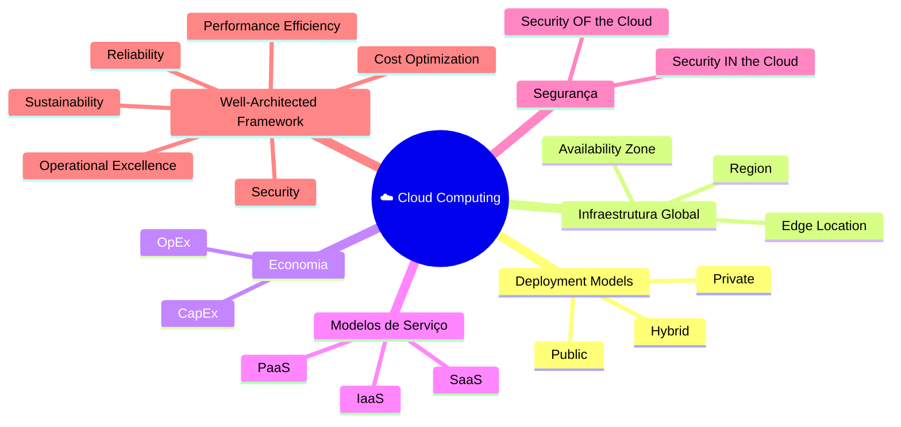

# 🧠 Mnemônicos e Revisão: Fundamentos e Infraestrutura Global

A **AWS Certified Cloud Practitioner (CLF-C02)** costuma cobrar conceitos muito parecidos entre si.

O segredo é associar cada termo a um **gatilho mental**.

Quando você enxergar determinadas palavras no enunciado, a resposta praticamente aparece sozinha.

---

## 1. As 6 Vantagens da Computação em Nuvem (The 6 Advantages)
Use o mnemônico:

> **T.E.P.A.V.G.**

Cada letra representa uma das vantagens oficiais da computação em nuvem segundo a AWS.


| Letra | Conceito (EN) | O que significa na prática? |
| :--- | :--- | :--- |
| **T** | **Trade** fixed expense for variable expense | Trocar **CapEx** por **OpEx**. Não enterra dinheiro em hardware; paga só o consumo. |
| **E** | Benefit from massive **Economies** of scale | Volume gera desconto. A AWS compra bilhões em hardware e repassa o preço baixo pra você. |
| **P** | Stop **Provisioning** (*Guessing capacity*) | **Pare de adivinhar**. a infraestrutura cresce conforme a demanda. |
| **A** | Increase speed and **Agility** | Agilidade de dev. Lançar infra em minutos em vez de esperar semanas pela entrega física. |
| **V** | Stop spending money running and maintaining **Data Centers** | Foque no **Valor** do negócio. Deixa a AWS cuidar do rack, cabos, energia e ar-condicionado. |
| **G** | Go **Global** in minutes | Alcance mundial. Coloque sua aplicação perto do usuário em qualquer lugar do mundo rápido. |

### Mnemônico

```
T.E.P.A.V.G.

T → Trade Fixed Expense
E → Economies of Scale
P → Provisioning (Stop Guessing Capacity)
A → Agility
V → Valor ao Negócio (AWS cuida dos Data Centers)
G → Go Global
```
---

# 2. Os 6 Pilares do AWS Well-Architected Framework

Para lembrar dos pilares, utilize o mnemônico:

> **C.O.R.P.S.S.**

Imagine o **"corpo"** sustentando uma arquitetura bem construída ou na "Estrutura" da arquitetura.

1.  **C**ost Optimization (Otimização de Custos): Entregar valor pelo menor preço. Reduzir custos e eliminar desperdícios.
2.  **O**perational Excellence (Excelência Operacional): Automatizar processos e melhorar continuamente a operação.
3.  **R**eliability (Confiabilidade): Garantir alta disponibilidade, recuperar de falhas e mitigar interrupções.
4.  **P**erformance Efficiency (Eficiência de Performance): Usar recursos de forma eficiente conforme a demanda.
5.  **S**ecurity (Segurança): Proteger dados, sistemas e ativos.
6.  **S**ustainability (Sustentabilidade): Minimizar o impacto ambiental.

### Mnemônico

```
C.O.R.P.S.S.

C → Cost Optimization
O → Operational Excellence
R → Reliability
P → Performance Efficiency
S → Security
S → Sustainability
```

---

## 3. "De / Para" de Termos Confusos (Trap Detection)

A banca vai tentar te confundir com esses pares. Use esta tabela como guia de desempate:

| Se o enunciado disser... | Pense imediatamente em... | Não confunda com... |
|---------------------------|---------------------------|---------------------|
| Localização geográfica isolada. | **AWS Region** | Availability Zone |
| Data centers redundantes dentro de uma Região. | **Availability Zone (AZ)** | Region |
| Cache próximo ao usuário. | **Edge Location** | Region |
| CDN global. | **Amazon CloudFront** | S3 |
| Investimento inicial elevado. | **CapEx** | OpEx |
| Pagamento conforme o uso. | **OpEx** | CapEx |
| Crescimento automático conforme a demanda. | **Elasticidade** | Escalabilidade |
| Crescimento mantendo desempenho. | **Escalabilidade** | Elasticidade |
| AWS protege hardware e infraestrutura física. | **Security OF the Cloud** | Security IN the Cloud |
| Cliente protege dados, usuários e configurações. | **Security IN the Cloud** | Security OF the Cloud |

---

## 4. Revisão em 1 Minuto

Leia estes termos em inglês e associe imediatamente ao conceito correto.

| Termo | Lembre-se de... |
|--------|-----------------|
| **Undifferentiated Heavy Lifting** | A AWS cuida do trabalho pesado de infraestrutura. |
| **Pay-as-you-go** | Pagamento conforme o consumo (OpEx). |
| **On-demand Delivery** | Recursos disponíveis imediatamente quando solicitados. |
| **High Availability** | Utilização de múltiplas Availability Zones. |
| **Disaster Recovery** | Recuperação utilizando múltiplas Regiões. |
| **Hybrid Cloud** | Integração entre ambiente local e AWS. |
| **AWS Outposts** | Infraestrutura AWS instalada dentro do data center do cliente. |
| **Edge Location** | Ponto de presença utilizado para reduzir latência. |
| **CloudFront** | CDN global da AWS. |
| **Cache Hit** | Conteúdo encontrado no cache da Edge Location. |
| **Cache Miss** | Conteúdo precisa ser buscado na origem. |

---

## 🚨 Pegadinhas Mais Frequentes

### Alta Disponibilidade ≠ Recuperação de Desastres

| High Availability | Disaster Recovery |
|-|-|
| utiliza múltiplas **Availability Zones** | utiliza múltiplas **Regiões** |

### Elasticidade ≠ Escalabilidade

| Elasticidade | Escalabilidade |
|-|-|
| cresce automaticamente; | aumenta a capacidade do ambiente; |
| reduz automaticamente; | mantém o desempenho durante o crescimento. |
| acompanha a demanda. ||

### Região ≠ Edge Location

| Region | Edge Location |
|-|-|
| hospeda aplicações; ||
| executa EC2; | distribui conteúdo;|
| executa RDS; | reduz latência;|
| executa EKS. | armazena cache. |

### CapEx ≠ OpEx

| CapEx | OpEx |
|-|-|
| compra servidores; | paga conforme utiliza; |
| investimento inicial; | sem investimento inicial elevado; |
| ativos físicos. | custo operacional variável. |

### Security OF ≠ Security IN

| Security OF the Cloud | Security IN the Cloud |
|-|-|
| hardware; | IAM; |
| rede; | dados; |
| data centers; | sistema operacional das EC2; |
| infraestrutura física. | Security Groups; |
|| configurações.|



---

## 🎯 Gatilho de Exame: Revisão em 1 Minuto

Memorize esses termos em inglês, pois eles são as âncoras das respostas:

*   **Undifferentiated heavy lifting:** Trabalho "sujo" de infra que a AWS assume pra você.
*   **Pay-as-you-go:** Pagamento conforme o uso (OpEx).
*   **High Availability:** Uso de múltiplas **AZs** para evitar queda.
*   **Disaster Recovery:** Uso de múltiplas **Regiões** para casos de catástrofe geográfica.
*   **On-demand delivery:** Entrega sob demanda via internet.
*   **Hybrid Cloud:** Conexão entre On-premises (seu local) e AWS via **VPN** ou **Direct Connect**.
*   **AWS Outposts:** Serviço que leva a AWS para dentro do seu data center local (Híbrido).

---

## 🚨 Sinal de Alerta

Sempre que a questão mencionar:

- **menor esforço operacional** → pense em **Serviços Gerenciados (Managed Services)** ou **Serverless** (como AWS Lambda, Amazon S3 e Amazon DynamoDB).

Sempre que mencionar:

- **maior controle e flexibilidade** → pense em **IaaS**, principalmente **Amazon EC2**.

Essa associação resolve uma grande quantidade de questões da prova.

---

### 🧭 Navegação de Conteúdos
* [🏠 Menu Principal](../README.md)
* [⬅️ Modelos de Implantação e AWS Well-Architected Framework](07-modelos-de-implantacao-e-framework-aws.md)
* [➡️ Lab: Explorando a Infraestrutura Global da AWS](09-lab-explorando-infraestrutura-global.md)

---
---