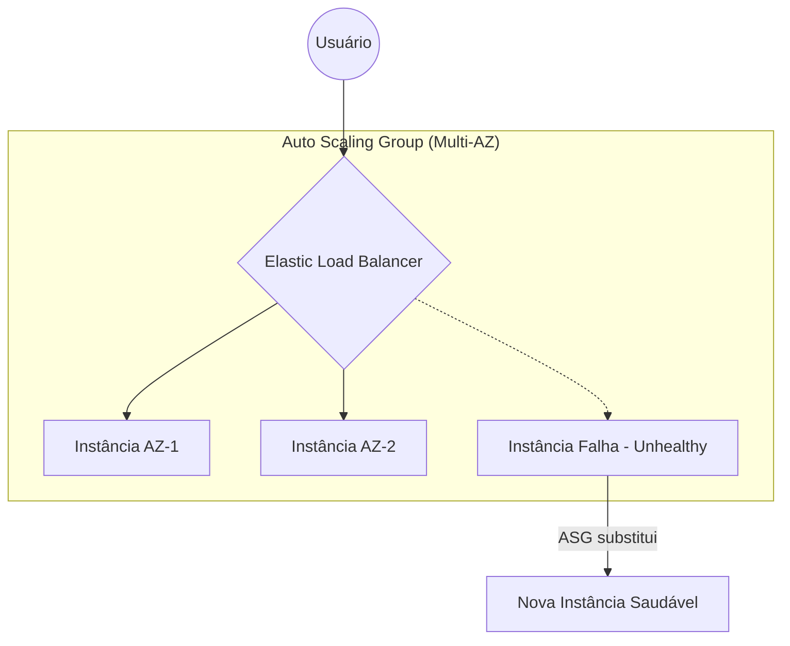

# ELB e Auto Scaling: O Combo da Alta Disponibilidade

De nada adianta ter uma aplicação excelente se ela para de responder quando recebe um pico de acessos ou se basta uma instância falhar para tudo ficar indisponível.

Na AWS, esse problema é resolvido com dois serviços que trabalham em conjunto: o **Elastic Load Balancing (ELB)** distribui o tráfego entre vários servidores, enquanto o **EC2 Auto Scaling (ASG)** garante que sempre exista a quantidade ideal de instâncias para atender à demanda.

Essa combinação é um dos pilares das arquiteturas de **Alta Disponibilidade (High Availability)** e **Elasticidade (Elasticity)**, sendo extremamente cobrada na prova CLF-C02.

---

# 1. Elastic Load Balancing (ELB): O Garçom Inteligente

O **Elastic Load Balancing (ELB)** é um serviço totalmente gerenciado que funciona como a porta de entrada da sua infraestrutura. Em vez de os usuários acessarem diretamente uma instância EC2, todas as requisições passam primeiro pelo Load Balancer, que distribui automaticamente o tráfego entre vários destinos (instâncias EC2, contêineres ou IPs) espalhados por diferentes **Availability Zones (AZs)**.

Entre seus principais benefícios estão:

- **Alta Disponibilidade:** Se uma instância falhar, o ELB para imediatamente de enviar tráfego para ela.
- **Escalabilidade:** O serviço suporta automaticamente o aumento do volume de acessos.
- **Abstração:** O usuário conhece apenas o DNS do Load Balancer, sem precisar saber quantos servidores existem por trás da aplicação.
- **Health Checks:** Monitora continuamente as instâncias e envia tráfego apenas para aquelas consideradas saudáveis.

---

### Os Tipos de Load Balancer que Caem na Prova

#### Application Load Balancer (ALB)

O **ALB** trabalha na **Camada 7 (HTTP/HTTPS)** e consegue analisar o conteúdo da requisição antes de decidir para onde encaminhá-la.

Exemplos:

- `/api` → API Servers
- `/imagens` → Image Servers
- `/admin` → Administração

É a escolha ideal para aplicações web modernas e arquiteturas de microsserviços.

---

#### Network Load Balancer (NLB)

O **NLB** opera na **Camada 4 (TCP/UDP)** e é voltado para cenários de alta performance.

É recomendado quando a aplicação exige:

- milhões de conexões por segundo;
- latência extremamente baixa;
- IP Estático;
- preservação do IP de origem do cliente.

---

#### Classic Load Balancer (CLB)

O **Classic Load Balancer** é o balanceador legado da AWS.

Ainda aparece na prova, mas para novos projetos a recomendação é utilizar **ALB** ou **NLB**.

---

### Comparação Rápida

| Load Balancer | Melhor uso |
|---------------|------------|
| ALB | HTTP/HTTPS, APIs e Microsserviços |
| NLB | TCP/UDP, baixa latência e IP Estático |
| CLB | Aplicações legadas |

---

# 2. EC2 Auto Scaling (ASG): Elasticidade na Veia

O **EC2 Auto Scaling Group (ASG)** é responsável por manter automaticamente a quantidade correta de instâncias EC2 em execução.

Quando a demanda aumenta, novas instâncias são criadas (**Scale-Out**). Quando a demanda diminui, instâncias excedentes são removidas (**Scale-In**). Dessa forma, a infraestrutura acompanha o uso da aplicação, mantendo desempenho sem desperdiçar recursos.

---

## Os 3 Pilares do ASG

Todo Auto Scaling Group é baseado em três configurações principais:

- **Minimum Capacity:** Quantidade mínima de instâncias que sempre permanecerão em execução. É comum definir pelo menos duas instâncias para garantir alta disponibilidade.
- **Desired Capacity:** Quantidade de instâncias que o ASG tentará manter durante a operação normal.
- **Maximum Capacity:** Limite máximo de crescimento do grupo, evitando custos inesperados durante grandes picos de utilização.

---

### Exemplo

Imagine a seguinte configuração:

| Configuração | Valor |
|--------------|------:|
| Minimum | 2 |
| Desired | 4 |
| Maximum | 10 |

Se uma das quatro instâncias falhar, o ASG criará automaticamente outra para voltar à capacidade desejada. Se a demanda aumentar, poderá escalar até dez instâncias, mas nunca ultrapassará esse limite.

---

# 3. O Segredo da Auto-Cura (Self-healing)

O Auto Scaling não serve apenas para aumentar ou diminuir o número de servidores. Ele também implementa o conceito de **Self-healing**, substituindo automaticamente instâncias com problema.

Para isso, utiliza **Health Checks**, que monitoram continuamente o estado das instâncias.

Se uma instância deixar de responder:

1. O ASG identifica que ela está **Unhealthy**.
2. Remove a instância do grupo.
3. Cria automaticamente uma nova instância utilizando o mesmo **Launch Template**.
4. Quando a nova instância estiver saudável, o ELB volta a direcionar tráfego para ela.

Todo esse processo acontece automaticamente, sem necessidade de intervenção manual.

---

## ELB x Auto Scaling

Apesar de normalmente trabalharem juntos, eles possuem responsabilidades diferentes.

| Serviço | Responsabilidade |
|----------|------------------|
| Elastic Load Balancer | Distribui o tráfego entre as instâncias disponíveis. |
| EC2 Auto Scaling | Cria, remove e substitui instâncias automaticamente. |
| Amazon CloudWatch | Fornece as métricas utilizadas pelo Auto Scaling para decidir quando escalar. |

---

## Casos clássicos de prova

### Cenário 1

> Minha aplicação recebe milhares de acessos simultaneamente.

Resposta: **Elastic Load Balancer + Auto Scaling**

---

### Cenário 2

> Preciso distribuir requisições HTTP para diferentes aplicações usando a URL.

Resposta: **Application Load Balancer (ALB)**

---

### Cenário 3

> Preciso de milhões de conexões TCP por segundo e IP fixo.

Resposta: **Network Load Balancer (NLB)**

---

### Cenário 4

> Uma instância EC2 falhou durante a madrugada.

Resposta: **O Auto Scaling detecta a falha e cria automaticamente uma nova instância.**

---

## Resumo Rápido

| Recurso | ELB | Auto Scaling |
|----------|:---:|:---:|
| Distribui tráfego | ✅ | ❌ |
| Cria novas instâncias | ❌ | ✅ |
| Remove instâncias | ❌ | ✅ |
| Substitui instâncias com falha | ❌ | ✅ |
| Alta disponibilidade | ✅ | ✅ |
| Elasticidade | ❌ | ✅ |

---

## 🎯 Gatilho de Exame

Mapeie esses termos para responder rapidamente às questões:

- **Elastic Load Balancing (ELB):** Distribuição de tráfego entre múltiplos destinos.
- **Application Load Balancer (ALB):** HTTP/HTTPS, Camada 7, roteamento por URL.
- **Network Load Balancer (NLB):** TCP/UDP, alta performance, IP Estático.
- **EC2 Auto Scaling Group (ASG):** Ajusta automaticamente o número de instâncias.
- **Health Checks:** Detectam instâncias com falha.
- **Scale-Out / Scale-In:** Adicionar ou remover instâncias conforme a demanda.
- **High Availability:** Arquitetura utilizando ELB + ASG distribuídos entre múltiplas AZs.

---

# Pegadinhas da Prova

| Se a questão perguntar... | Resposta |
|---------------------------|----------|
| Distribuir tráfego HTTP por URL | ALB |
| Distribuir tráfego TCP/UDP | NLB |
| Preciso de IP Estático | NLB |
| Balancear requisições entre EC2 | ELB |
| Criar novas instâncias automaticamente | Auto Scaling |
| Substituir instâncias com falha | Auto Scaling |
| Escalar utilizando CPU ou métricas | CloudWatch + Auto Scaling |

---

> **💡 Dica de Ouro:** Pense sempre na dupla. O **ELB** distribui as requisições entre os servidores, enquanto o **Auto Scaling** garante que exista a quantidade certa de instâncias para atender à demanda. Um cuida do tráfego; o outro cuida da capacidade da infraestrutura.

---

### 🧭 Navegação de Conteúdos
* [🏠 Menu Principal](../README.md)
* [⬅️ Módulo 3: Opções de Compra EC2 e a Regra de Ouro Spot](01-opcoes-de-compra-regra-de-ouro-spot.md)
* [➡️ Módulo 3: AWS Lambda - Processamento Serverless e Event-Driven](03-lambda-processamento-serverless-event-driven.md)

---
---