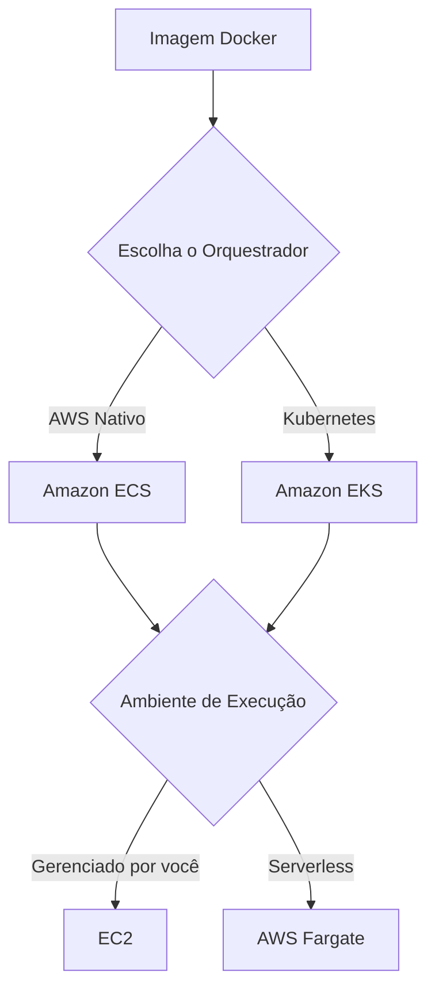

# Contêineres na AWS: ECS, EKS e a Revolução Fargate

Se você ainda sofre com o clássico "na minha máquina funciona", os contêineres resolvem esse problema empacotando a aplicação com todas as suas dependências. Na AWS, entender a diferença entre **Amazon ECS**, **Amazon EKS** e **AWS Fargate** é fundamental, porque a prova vive misturando os papéis de cada um.

---

## 1. O que são Contêineres?

Contêineres empacotam a aplicação junto com bibliotecas, runtime e configurações, garantindo que ela execute da mesma forma em qualquer ambiente.

**Principais vantagens:**

* **Consistência:** O mesmo contêiner funciona em desenvolvimento, homologação e produção.
* **Leveza:** Compartilha o kernel do sistema operacional, consumindo menos recursos que uma máquina virtual.
* **Inicialização rápida:** Normalmente sobe em segundos.
* **Portabilidade:** Pode ser movido entre ambientes sem necessidade de reconfiguração.

> **Resumo:** VM virtualiza o hardware. Contêiner virtualiza a aplicação.

---

## 2. ECS vs. EKS

Executar um contêiner é simples. Gerenciar centenas ou milhares deles é função de um **orquestrador**.

### Amazon ECS (Elastic Container Service)

É o orquestrador nativo da AWS.

* Simples de configurar.
* Integração nativa com IAM, VPC, ELB, CloudWatch e demais serviços AWS.
* Ideal quando toda a infraestrutura está na AWS.

> **Pense assim:** Quer simplicidade? ECS.

### Amazon EKS (Elastic Kubernetes Service)

É o serviço gerenciado de **Kubernetes**.

A AWS administra o **Control Plane**, enquanto você continua utilizando todo o ecossistema Kubernetes.

É indicado quando:

* sua empresa já utiliza Kubernetes;
* existe necessidade de portabilidade entre provedores;
* o time já domina Kubernetes.

> **Pense assim:** Precisa de Kubernetes? Use EKS.

---

## 3. AWS Fargate: Serverless para Contêineres

O **AWS Fargate** não é um orquestrador.

Ele é o mecanismo de computação que executa contêineres **sem precisar gerenciar instâncias EC2**.

Você informa apenas:

* CPU
* Memória

O restante fica por conta da AWS.

**Principais benefícios:**

* Não administra servidores.
* Não aplica patches no sistema operacional.
* Escala automaticamente.
* Paga apenas pelos recursos utilizados.

> **Resumo:** ECS e EKS dizem **como organizar os contêineres**. O Fargate define **onde eles executam**, sem EC2.

---

## 4. Comparativo Rápido

| Serviço | Função |
| :--- | :--- |
| **Amazon ECS** | Orquestrador de contêineres nativo da AWS. |
| **Amazon EKS** | Kubernetes gerenciado pela AWS. |
| **AWS Fargate** | Computação serverless para executar contêineres. |
| **Amazon ECR** | Repositório de imagens Docker. |

---

## 🎯 Gatilho de Exame

Se aparecer...

* **Amazon ECS:** Orquestração de contêineres nativa da AWS.
* **Amazon EKS:** Kubernetes gerenciado.
* **AWS Fargate:** Executar contêineres **sem gerenciar servidores**.
* **Amazon ECR:** Repositório de imagens Docker.
* **Container orchestration:** ECS ou EKS.
* **Serverless containers:** Fargate.

> **Sinal de Alerta:** A banca gosta de trocar **ECS** por **Fargate**. Lembre-se: **ECS e EKS são orquestradores. Fargate não é. Ele apenas fornece a infraestrutura serverless onde os contêineres executam.** Outro detalhe comum é esquecer do **Amazon ECR**, que é apenas o repositório de imagens e não executa contêineres.

---

### 🧭 Navegação de Conteúdos
* [🏠 Menu Principal](../README.md)
* [⬅️ Módulo 3: AWS Lambda - Processamento Serverless e Event-Driven](03-lambda-processamento-serverless-event-driven.md)
* [➡️ Módulo 3: Amazon Lightsail e AWS Batch - Simplicidade e Lote](05-outras-opcoes-lightsail-e-batch.md)

---
---