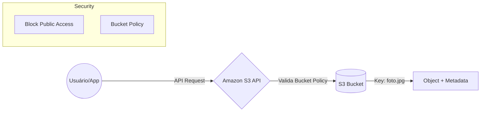

# Amazon S3: Armazenamento de Objetos e API

Se você vai trabalhar com AWS, o **Amazon S3 (Simple Storage Service)** é um daqueles serviços que aparecem em praticamente todo projeto. Seja para armazenar imagens, backups, vídeos, logs ou arquivos estáticos de um site, é muito provável que exista um bucket S3 envolvido.

Mas existe uma diferença importante: o S3 **não é um disco virtual** como o Amazon EBS. Ele é um serviço de **Object Storage**, ou seja, foi criado para armazenar e entregar arquivos através de uma API, com escalabilidade praticamente ilimitada.

Outro ponto que faz o S3 ser tão famoso é sua durabilidade de **99,999999999% (11 noves)**.

Traduzindo para a vida real: se você armazenar milhões de objetos, a chance de perder um deles é extremamente baixa. É por isso que o S3 é utilizado para armazenar desde fotos de aplicativos até backups críticos de grandes empresas.

---

# 1. Conceitos Fundamentais

Antes de decorar nomes de serviços, vale entender como o S3 é organizado. A estrutura dele é simples, mas algumas características aparecem o tempo todo na CLF-C02.

## Buckets (Os Contêineres)

Os **Buckets** funcionam como os contêineres onde todos os objetos serão armazenados.

Pense neles como a "porta de entrada" dos seus arquivos.

Algumas características importantes:

- **Nome globalmente único:** o nome de um bucket deve ser exclusivo em toda a AWS. Se alguém já criou `meu-backup`, nenhuma outra conta poderá utilizar exatamente esse nome.

- **Escopo regional:** embora o nome seja global, o bucket é criado em uma Região específica. Isso ajuda a reduzir latência e atender requisitos de residência de dados.

> **Pegadinha de prova:** bucket é um recurso **regional**, mas o **nome** precisa ser único no mundo inteiro.

---

## Objetos (Objects) e Keys

Dentro do bucket ficam os **Objects**, que representam os arquivos armazenados.

Cada objeto possui:

- os dados do arquivo (**Payload**);
- metadados (**Metadata**), como tamanho, tipo do arquivo e tags;
- uma **Key**, que identifica o objeto de forma única dentro do bucket.

Por exemplo:

```text
s3://meu-bucket/projeto/docs/manual.pdf
```

Nesse caso:

- Bucket → `meu-bucket`
- Key → `projeto/docs/manual.pdf`

Outro detalhe importante: o S3 **não possui pastas reais**.

As "pastas" que você vê no Console da AWS são apenas partes da **Key**, chamadas de **prefixos**.

Na prática, o S3 armazena uma lista de objetos, e a interface organiza essas chaves para parecer uma estrutura de diretórios.

> Essa diferença entre "pastas" e "prefixos" costuma aparecer em questões conceituais.

---

## Versioning (Versionamento)

O **S3 Versioning** funciona como uma rede de segurança para seus arquivos.

Quando ele está habilitado, toda alteração gera uma nova versão do objeto em vez de substituir a anterior.

Isso traz duas vantagens importantes:

- Se um arquivo for sobrescrito, a versão antiga continua armazenada e pode ser recuperada.
- Se alguém excluir um objeto, o S3 cria um **Delete Marker**, ocultando o arquivo sem apagar imediatamente as versões anteriores.

Na prática, o Versioning protege contra exclusões acidentais e facilita a recuperação de versões antigas dos arquivos.

> **Pegadinha de prova:** habilitar o Versioning não impede exclusões. Ele apenas permite recuperar versões anteriores.

---

# 2. Segurança e Controle de Acesso

O Amazon S3 segue uma filosofia simples:

**Tudo começa privado.**

Nenhum bucket ou objeto fica público automaticamente.

Para controlar quem pode acessar os dados, os recursos mais cobrados na prova são estes:

### Block Public Access

É a primeira camada de proteção do S3.

Ela bloqueia tentativas de tornar buckets ou objetos públicos, mesmo que exista alguma política permitindo esse acesso.

Por padrão, essa proteção já vem habilitada para novos buckets.

É uma das principais defesas contra vazamentos acidentais de dados.

---

### Bucket Policies

As **Bucket Policies** são documentos em formato **JSON** anexados diretamente ao bucket.

Elas definem quem pode acessar o bucket e quais ações cada identidade poderá executar.

Por exemplo:

- permitir leitura para uma aplicação;
- bloquear exclusão de objetos;
- liberar acesso apenas para uma conta específica.

Na prática, é o mecanismo de controle de acesso mais utilizado no Amazon S3.

---

### Access Control Lists (ACLs)

As **ACLs** são um modelo mais antigo de controle de permissões.

Elas permitem conceder acesso diretamente a buckets ou objetos individuais.

Hoje, a AWS recomenda utilizar principalmente **IAM Policies** e **Bucket Policies**, deixando as ACLs apenas para cenários específicos ou de compatibilidade.

> **Pegadinha de prova:** se aparecer Bucket Policy e ACL na mesma questão, normalmente a resposta correta tende para **Bucket Policy**, já que é o modelo recomendado pela AWS.



---

# 🎯 Gatilho de Exame

Se encontrar estes termos no enunciado, pense imediatamente em **Amazon S3**.

- **Amazon S3:** serviço de armazenamento de objetos altamente escalável e durável.
- **Object Storage:** armazenamento baseado em objetos identificados por uma Key.
- **Bucket:** contêiner onde os objetos são armazenados.
- **Globally Unique Bucket Name:** nome do bucket deve ser único em toda a AWS.
- **Object Key:** identificador exclusivo de um objeto dentro do bucket.
- **Eleven Nines of Durability:** durabilidade de 99,999999999%.
- **Versioning:** proteção contra sobrescritas e exclusões acidentais.
- **Bucket Policies:** políticas JSON para controlar acesso ao bucket.
- **Static Website Hosting:** hospedagem de sites HTML, CSS e JavaScript diretamente no S3.

---

> **⚠️ Sinal de Alerta**
>
> Uma das confusões mais comuns na prova é misturar **S3** com **EBS**.
>
> - **Amazon S3:** armazena arquivos como objetos e é acessado via API (HTTP/HTTPS).
> - **Amazon EBS:** funciona como um disco virtual anexado a uma instância EC2.
>
> Se o enunciado falar em **instalar um sistema operacional**, montar um volume ou utilizar um disco para um servidor, a resposta **não é S3**.
>
> Se falar em armazenar imagens, vídeos, backups, logs ou hospedar um site estático, provavelmente o serviço correto será o **Amazon S3**.

---

### 🧭 Navegação de Conteúdos
* [🏠 Menu Principal](../README.md)
* [⬅️ Módulo 3: Micro-Simulado - Computação e Containers](../03-computacao-e-containers/09-micro-simulado-computacao.md)
* [➡️ Módulo 4: S3 - Classes de Armazenamento e Ciclo de Vida](01-s3-classes-de-armazenamento-e-ciclo-vida.md)

---