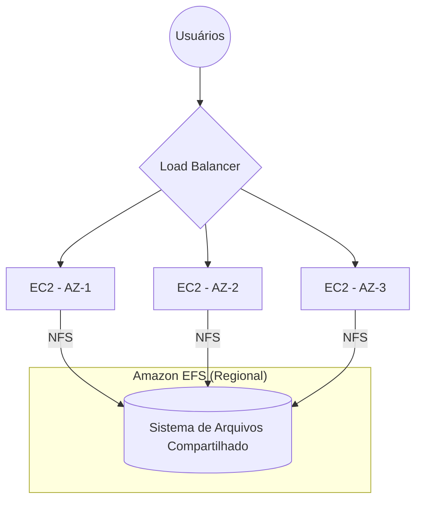

# Amazon EFS: Arquivos Compartilhados e a Magia do NFS

Imagine um cluster com 10 servidores rodando WordPress atrás de um Load Balancer. Um usuário faz upload de uma imagem. Como garantir que essa imagem esteja disponível imediatamente em qualquer servidor que atender a próxima requisição?

Se cada instância tiver seu próprio disco EBS, cada uma enxergará apenas os próprios arquivos. Resultado: alguns usuários verão a imagem, outros não.

É exatamente esse problema que o **Amazon EFS (Elastic File System)** resolve: um único sistema de arquivos compartilhado entre várias instâncias EC2.

---

# 1. O que é o Amazon EFS?

O **Amazon EFS** é um serviço de **File Storage** totalmente gerenciado pela AWS.

Ele utiliza o protocolo **NFS (Network File System)**, permitindo que várias instâncias Linux montem exatamente o mesmo sistema de arquivos ao mesmo tempo.

Na prática, pense nele como um "servidor de arquivos na nuvem".

Em vez de cada servidor possuir seus próprios arquivos, todos compartilham o mesmo armazenamento.

Isso traz duas grandes vantagens:

- qualquer alteração feita por uma instância fica imediatamente disponível para as demais;
- não existe preocupação em sincronizar arquivos manualmente entre servidores.

Outro diferencial importante é justamente o nome **Elastic**.

Você não precisa definir previamente o tamanho do armazenamento.

À medida que novos arquivos são gravados, o EFS cresce automaticamente.

Quando arquivos são removidos, ele reduz o espaço utilizado.

Você paga apenas pelo armazenamento efetivamente consumido.

> **Pegadinha de prova:** diferente do Amazon EBS, você não precisa provisionar um volume de 100 GB, 500 GB ou 1 TB. O EFS cresce e diminui sozinho.

---

# 2. O Diferencial de Prova: Arquitetura Regional (Multi-AZ)

Esse é um dos assuntos favoritos da banca porque confunde muita gente.

A diferença entre EBS e EFS parece pequena, mas muda completamente o cenário.

| Amazon EBS | Amazon EFS |
|------------|------------|
| Existe dentro de apenas uma AZ. | É um serviço Regional. |
| Normalmente atende uma única instância EC2. | Pode ser utilizado simultaneamente por milhares de instâncias. |
| Ideal para disco do servidor. | Ideal para arquivos compartilhados. |

Na prática:

- uma instância na **AZ-1** pode acessar o mesmo diretório que uma instância na **AZ-2**;
- ambas podem ler e gravar arquivos simultaneamente;
- os dados permanecem sincronizados automaticamente.

Essa arquitetura é chamada de **Concurrent Access** e é um dos principais motivos para utilizar o EFS em aplicações altamente disponíveis.

> **Pegadinha de prova:** se a questão falar em "várias instâncias compartilhando os mesmos arquivos", dificilmente a resposta será EBS. Quase sempre será **Amazon EFS**.

---

# 3. Casos de Uso Clássicos

Sempre que o enunciado apresentar um destes cenários, vale a pena pensar em **Amazon EFS**.

- **WordPress ou Drupal em Auto Scaling:** todas as instâncias precisam acessar a mesma pasta de `uploads`, garantindo que qualquer servidor consiga entregar imagens e documentos enviados pelos usuários.

- **Diretórios Home compartilhados:** usuários podem fazer login em diferentes servidores Linux e continuar enxergando exatamente os mesmos arquivos pessoais.

- **Ferramentas de desenvolvimento:** equipes compartilham repositórios, scripts, bibliotecas ou artefatos sem precisar copiar arquivos entre servidores.

- **Processamento paralelo de dados:** vários nós trabalham simultaneamente sobre o mesmo conjunto de arquivos, muito comum em workloads de análise de dados.

- **Aplicações distribuídas:** quando diferentes servidores precisam compartilhar arquivos de configuração, certificados, templates ou conteúdo estático.

> Esse tipo de cenário aparece com bastante frequência na CLF-C02 porque diferencia claramente **File Storage** de **Block Storage**.

---

# 4. Comparativo de Arquitetura: EBS vs. EFS vs. S3

Quando bater dúvida na prova, faça duas perguntas:

1. Vou montar um disco?
2. Vou compartilhar arquivos?
3. Vou acessar objetos via API?

A resposta normalmente leva direto ao serviço correto.

| Característica | Amazon EBS | Amazon EFS | Amazon S3 |
| :--- | :--- | :--- | :--- |
| **Tipo de Armazenamento** | Block Storage | File Storage | Object Storage |
| **Escopo Geográfico** | Uma AZ | Regional (Multi-AZ) | Bucket Regional |
| **Forma de Acesso** | Disco anexado ao EC2 | NFS | API HTTP/HTTPS |
| **Principal Uso** | Sistema Operacional, bancos de dados e aplicações | Arquivos compartilhados | Backups, imagens, vídeos, logs e arquivos em geral |
| **Acesso Simultâneo** | Não (na maioria dos casos) | Sim | Sim |
| **Crescimento Automático** | Não | Sim | Sim |

---

# 🎯 Gatilho de Exame

Se aparecer algum destes termos, pense imediatamente em **Amazon EFS**.

- **Amazon EFS:** sistema de arquivos gerenciado e elástico.
- **NFS (Network File System):** protocolo utilizado para montar o armazenamento.
- **Shared File System:** vários servidores utilizando os mesmos arquivos.
- **Concurrent Access:** múltiplas instâncias lendo e gravando simultaneamente.
- **Multi-AZ File Sharing:** compartilhamento de arquivos entre diferentes Zonas de Disponibilidade.
- **Elastic Storage:** cresce automaticamente conforme a utilização.
- **Linux File System:** armazenamento compartilhado para workloads Linux.

---

> **⚠️ Sinal de Alerta**
>
> Uma forma rápida de diferenciar os três serviços:
>
> - **Amazon EBS:** o "HD/SSD" da instância EC2.
> - **Amazon EFS:** o "servidor de arquivos" compartilhado entre várias instâncias Linux.
> - **Amazon S3:** um armazenamento de objetos acessado via API, ideal para arquivos, backups, imagens e documentos.
>
> Se a questão disser **"várias instâncias precisam acessar exatamente os mesmos arquivos ao mesmo tempo"**, praticamente pode marcar **Amazon EFS** sem medo.

---

### 🧭 Navegação de Conteúdos
* [🏠 Menu Principal](../README.md)
* [⬅️ Módulo 4: Amazon EBS - Volumes em Bloco e o Disco Virtual do EC2](02-ebs-volumes-em-bloco-disco-virtual.md)
* [➡️ Módulo 4: Arquivamento - Glacier Flexible Retrieval vs. Deep Archive](04-arquivamento-glacier-flexible-vs-deep-archive.md)

---
---