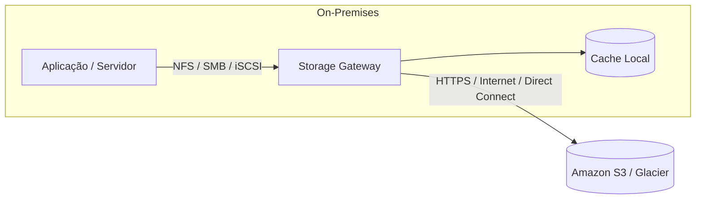

# AWS Storage Gateway: A Ponte para a Nuvem Híbrida

Mano, papo reto: nem toda empresa consegue desligar o data center local e migrar tudo para a AWS da noite para o dia.

Na prática, muitas aplicações ainda dependem de protocolos tradicionais como **NFS**, **SMB** ou **iSCSI**. Reescrever essas aplicações para conversar diretamente com o Amazon S3 pode custar tempo, dinheiro e muito trabalho.

É justamente aí que entra o **AWS Storage Gateway**.

Pense nele como uma **ponte** entre o ambiente local (**on-premises**) e a AWS. Para a aplicação, tudo continua parecendo um armazenamento tradicional. Nos bastidores, o Gateway sincroniza os dados com a nuvem.

---

## 1. O que é o AWS Storage Gateway?

O **AWS Storage Gateway** é um serviço de **Hybrid Cloud Storage**, criado para conectar o armazenamento local aos serviços de armazenamento da AWS.

Ele normalmente é instalado como uma **máquina virtual (VM)** dentro da infraestrutura da empresa.

Na prática, ele resolve um problema muito comum:

> "Quero aproveitar o armazenamento praticamente ilimitado da AWS, mas minha aplicação só sabe usar NFS, SMB ou iSCSI."

Com o Storage Gateway, você não precisa modificar a aplicação.

---

## 2. Por que usar?

O objetivo do Storage Gateway é modernizar o armazenamento sem quebrar o ambiente atual.

Entre as principais vantagens estão:

- **Integração com sistemas legados:** aplicações continuam funcionando normalmente enquanto os dados passam a ser armazenados na AWS.

- **Cache local:** os arquivos mais acessados permanecem localmente, reduzindo a latência.

- **Escalabilidade:** o armazenamento cresce utilizando os serviços da AWS, sem depender apenas do hardware local.

- **Conexão segura:** toda a comunicação entre o Gateway e a AWS é criptografada.

> **Na prática:** para o servidor da empresa, parece que o arquivo está no armazenamento local. Na realidade, ele já está sendo sincronizado com a AWS.

---

## 3. Os 3 tipos de Gateway (Esse cai bastante na prova)

A CLF-C02 costuma apresentar um cenário e pedir qual Gateway resolve o problema.

A lógica é simples:

- **Arquivos → File Gateway**
- **Blocos → Volume Gateway**
- **Fitas → Tape Gateway**

Vamos entender cada um.

---

### A. S3 File Gateway (Arquivos)

É a opção mais utilizada.

Permite que aplicações continuem acessando arquivos usando **NFS** ou **SMB**, enquanto o Gateway grava tudo como **objetos no Amazon S3**.

**Protocolos**

- NFS (Linux)
- SMB (Windows)

**Como funciona**

Você compartilha uma pasta na rede.

Sempre que alguém salva um arquivo nessa pasta, o Gateway converte esse arquivo em um objeto dentro do Amazon S3.

**Quando usar**

- Compartilhamento de arquivos.
- Repositórios de documentos.
- Data Lakes.
- Aplicações que já utilizam NFS ou SMB.

---

### B. Volume Gateway (Blocos)

Aqui o foco muda completamente.

Em vez de arquivos, o Volume Gateway fornece **armazenamento em bloco** utilizando **iSCSI**.

Ele possui dois modos de funcionamento.

#### Cached Volumes

O dado principal fica armazenado na AWS.

Localmente permanece apenas um cache com os arquivos mais utilizados.

**Quando usar**

Quando você quer economizar armazenamento local sem perder desempenho para os dados mais acessados.

---

#### Stored Volumes

O dado principal permanece dentro da empresa.

A AWS recebe apenas cópias de segurança na forma de **EBS Snapshots**.

**Quando usar**

Quando você precisa manter todos os dados localmente, mas deseja utilizar a AWS para backup e Disaster Recovery.

> **Pegadinha clássica:**  
> **Cached Volumes** → dado principal na AWS.  
> **Stored Volumes** → dado principal no ambiente local.

---

### C. Tape Gateway (Fitas)

Esse Gateway foi criado para substituir bibliotecas de fitas físicas.

Ele simula uma **Virtual Tape Library (VTL)**.

Para o software de backup, nada muda.

Ele continua acreditando que está gravando em fitas tradicionais.

Nos bastidores, os dados são enviados para a AWS.

- Fitas ativas → Amazon S3.
- Fitas arquivadas → S3 Glacier.

**Quando usar**

- Empresas que utilizam Veeam, Veritas ou softwares semelhantes.
- Ambientes que ainda dependem de fitas magnéticas.
- Arquivamento de longo prazo.

Você elimina as fitas físicas sem precisar trocar o software de backup.

---

## 4. Como escolher rapidamente?

Se aparecer...

| O cenário fala sobre... | Escolha |
| :--- | :--- |
| Compartilhar arquivos usando **NFS** ou **SMB** | **S3 File Gateway** |
| Disco virtual utilizando **iSCSI** | **Volume Gateway** |
| Substituir fitas físicas (VTL) | **Tape Gateway** |

> **Essa associação aparece com bastante frequência na CLF-C02.** Se decorar essa tabela, você resolve boa parte das questões sobre Storage Gateway.

---

## 5. Cenário clássico de prova

**Enunciado**

> Uma empresa possui um servidor de arquivos que utiliza SMB e deseja armazenar esses dados no Amazon S3 sem modificar a aplicação existente, mantendo acesso rápido aos arquivos mais utilizados.

**Resposta**

**AWS Storage Gateway — S3 File Gateway**

**Por quê?**

Porque ele:

- suporta SMB;
- envia os arquivos para o Amazon S3;
- mantém cache local para acesso rápido.

Se esses três requisitos aparecerem juntos, praticamente não existe outra resposta.

---

## 🎯 Gatilho de Exame

Se aparecer qualquer um destes termos, pense em **AWS Storage Gateway**:

- **Hybrid Cloud Storage:** integração entre armazenamento local e AWS.
- **On-premises integration:** conectar aplicações locais aos serviços da AWS.
- **Local caching:** cache local para reduzir latência.
- **S3 File Gateway:** NFS, SMB e arquivos armazenados no Amazon S3.
- **Volume Gateway:** iSCSI e armazenamento em bloco.
- **Cached Volumes:** armazenamento principal na AWS.
- **Stored Volumes:** armazenamento principal no ambiente local.
- **Tape Gateway:** Virtual Tape Library (VTL) e substituição de fitas físicas.

> **🚨 Sinal de Alerta:** Não confunda **Storage Gateway** com a **AWS Snow Family**. Ambos trabalham com ambientes on-premises, mas resolvem problemas diferentes.
>
> - **Snow Family:** migração física de grandes volumes de dados, normalmente uma única vez.
> - **Storage Gateway:** integração contínua entre o ambiente local e a AWS.
>
> Se a questão falar em uma "ponte permanente" entre o data center e a nuvem, a resposta é **AWS Storage Gateway**.

---

### 🧭 Navegação de Conteúdos
* [🏠 Menu Principal](../README.md)
* [⬅️ Módulo 4: Família AWS Snow - Migração Física e Offline](05-migracao-fisica-familia-snow-offline.md)
* [➡️ Módulo 4: S3 vs. EBS vs. EFS - O Tira-Dúvidas de Armazenamento](07-tabela-objeto-s3-bloco-ebs-arquivo-efs.md)

---
---