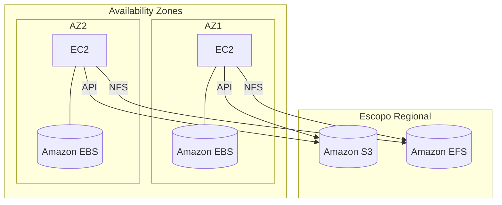

# S3 vs. EBS vs. EFS: O Guia Definitivo para Nunca Mais Confundir

Essa é, sem exagero, uma das comparações que mais aparecem na **CLF-C02**.

A banca adora colocar **Amazon S3**, **Amazon EBS** e **Amazon EFS** na mesma questão para descobrir se você realmente entende **qual tipo de armazenamento resolve cada problema**.

A lógica é simples:

- Precisa de um **disco** para uma máquina? → **EBS**
- Precisa de uma **pasta compartilhada** entre vários servidores? → **EFS**
- Precisa guardar **arquivos acessados via API** com escalabilidade praticamente ilimitada? → **S3**

Se você decorar apenas essa lógica, já elimina muitas alternativas erradas.

---

## 1. Primeiro Entenda a Diferença

Apesar de todos armazenarem dados, eles trabalham de formas completamente diferentes.

| Serviço | Como enxerga os dados | Pense como... |
| :--- | :--- | :--- |
| **Amazon S3** | Objetos | Um serviço de armazenamento na internet |
| **Amazon EBS** | Blocos | Um SSD conectado à sua EC2 |
| **Amazon EFS** | Arquivos | Um servidor de arquivos compartilhado (NFS) |

Uma analogia ajuda bastante:

- **EBS:** é como instalar um SSD dentro do computador.
- **EFS:** é como um drive de rede compartilhado pela empresa.
- **S3:** é como um grande repositório de arquivos acessado pela aplicação através de uma API.

---

## 2. Comparativo Completo

| Característica | Amazon S3 | Amazon EBS | Amazon EFS |
| :--- | :--- | :--- | :--- |
| **Tipo de Storage** | **Object Storage** | **Block Storage** | **File Storage** |
| **Como é acessado?** | API (HTTP/HTTPS) | Disco anexado à EC2 | NFS |
| **Escopo** | Bucket regional (nome globalmente único) | Apenas uma AZ | Regional (Multi-AZ) |
| **Compartilhamento simultâneo** | Sim (via API) | Não (uso tradicional: uma EC2) | Sim (centenas ou milhares de EC2) |
| **Escalabilidade** | Automática | Você provisiona o tamanho | Automática |
| **Uso clássico** | Backups, imagens, vídeos, logs, sites estáticos | Disco do sistema, bancos de dados | WordPress, diretórios Home, compartilhamento de arquivos |

---

## 3. Quando Escolher Cada Um?

### Amazon S3

Escolha o **Amazon S3** quando a aplicação trabalha com **objetos**.

Casos clássicos:

- Hospedar um site estático (HTML, CSS e JavaScript).
- Armazenar backups.
- Guardar fotos e vídeos enviados pelos usuários.
- Centralizar logs.
- Construir Data Lakes.

O acesso acontece via **API**, nunca como um disco do sistema operacional.

---

### Amazon EBS

Escolha o **Amazon EBS** quando uma instância EC2 precisa de um **disco**.

Casos clássicos:

- Instalar Windows ou Linux.
- Disco de boot da EC2.
- Bancos de dados.
- Aplicações que exigem baixa latência de armazenamento.

Lembre-se de uma característica importante:

- O volume fica dentro de **uma única Availability Zone**.

Se a instância mudar de AZ, o volume não acompanha automaticamente.

> Essa é uma das pegadinhas favoritas da prova.

---

### Amazon EFS

Escolha o **Amazon EFS** quando **várias instâncias Linux** precisam acessar exatamente os mesmos arquivos.

Casos clássicos:

- WordPress compartilhando a pasta de uploads.
- Diretórios Home compartilhados entre servidores.
- Ambientes de desenvolvimento.
- Aplicações distribuídas que precisam enxergar o mesmo sistema de arquivos.

O acesso acontece usando o protocolo **NFS**.

Como o serviço é **regional**, instâncias em diferentes Availability Zones conseguem acessar os mesmos arquivos simultaneamente.

---

## 4. Comparando a Arquitetura

---

## 5. Decisão Rápida na Prova

Quando aparecer um cenário, tente responder estas perguntas:

### A aplicação precisa instalar um sistema operacional?

✅ Amazon EBS

---

### Precisa compartilhar a mesma pasta entre vários servidores Linux?

✅ Amazon EFS

---

### Precisa armazenar arquivos praticamente ilimitados?

✅ Amazon S3

---

### O acesso será feito por HTTP/HTTPS ou SDK da AWS?

✅ Amazon S3

---

### Precisa de um disco para banco de dados?

✅ Amazon EBS

---

### Um cluster WordPress precisa compartilhar a pasta `uploads`?

✅ Amazon EFS

> Esse cenário aparece com frequência na CLF-C02.

---

## 6. Erros Clássicos da CLF-C02

A banca costuma criar alternativas parecidas para confundir.

### ❌ "Guardar banco de dados no S3"

Errado.

O banco precisa de armazenamento em bloco.

**Resposta:** Amazon EBS.

---

### ❌ "Instalar Windows diretamente no S3"

Errado.

O S3 não funciona como disco.

**Resposta:** Amazon EBS.

---

### ❌ "Compartilhar arquivos entre dezenas de EC2 usando EBS"

Errado.

O EBS não foi feito para compartilhamento simultâneo entre várias instâncias.

**Resposta:** Amazon EFS.

---

### ❌ "Usar EFS para hospedar um site estático"

Errado.

Um site HTML simples pode ser hospedado diretamente no Amazon S3, com menor custo e muito mais simplicidade.

---

## 🎯 Gatilho de Exame

Sempre associe estes termos ao serviço correto:

| Se aparecer... | Pense em... |
| :--- | :--- |
| **Object Storage** | Amazon S3 |
| **Block Storage** | Amazon EBS |
| **File Storage** | Amazon EFS |
| **NFS** | Amazon EFS |
| **Boot Volume** | Amazon EBS |
| **Shared File System** | Amazon EFS |
| **Static Website Hosting** | Amazon S3 |
| **Bucket** | Amazon S3 |
| **Multi-AZ File Sharing** | Amazon EFS |
| **Disk for EC2** | Amazon EBS |
| **API / HTTP / HTTPS** | Amazon S3 |

> **Sinal de Alerta:** Sempre faça esta associação mental:
>
> - **Amazon S3** → Objetos acessados via API.
> - **Amazon EBS** → Disco de uma instância EC2.
> - **Amazon EFS** → Pasta compartilhada entre servidores Linux.
>
> Se você lembrar apenas dessa regra, já resolve grande parte das questões de armazenamento da CLF-C02.

---

### 🧭 Navegação de Conteúdos
* [🏠 Menu Principal](../README.md)
* [⬅️ Módulo 4: AWS Storage Gateway - A Ponte para a Nuvem Híbrida](06-nuvem-hibrida-storage-gateway.md)
* [➡️ Módulo 4: Mnemônicos e Atalhos - O Guia de Sobrevivência em Armazenamento](08-mnemonicos-armazenamento.md)

---
---