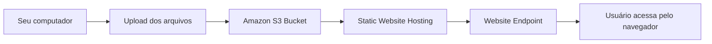

# Lab: Hospedagem de Site Estático no Amazon S3

Muita gente acredita que precisa de uma instância EC2 rodando Apache ou Nginx para publicar um site. Na prática, se o conteúdo for **estático** (HTML, CSS, JavaScript, imagens e fontes), isso é desperdício de dinheiro e de gerenciamento.

O **Amazon S3** consegue hospedar esse tipo de site com custo muito baixo, alta disponibilidade e escalabilidade praticamente ilimitada. Você só envia os arquivos e a AWS faz o resto.

Neste laboratório, vamos transformar um simples bucket em um servidor web.

---

## 1. Objetivos do Lab

Ao final deste laboratório você terá aprendido a:

- Criar um **Amazon S3 Bucket** com nome globalmente exclusivo.
- Configurar o **Static Website Hosting**.
- Ajustar o **Block Public Access** para permitir acesso público ao site.
- Criar uma **Bucket Policy** liberando leitura dos arquivos.
- Fazer upload do conteúdo.
- Publicar o site e validar o funcionamento.

---

## 2. Como Funciona

Antes de colocar a mão na massa, vale entender o fluxo.



A ideia é simples:

1. Você envia os arquivos para o bucket.
2. O S3 passa a servir esses arquivos como páginas web.
3. Os usuários acessam o endereço público gerado pela AWS.

---

## 3. Passo 1 — Criando o Bucket

1. Abra o **Console AWS**.
2. Pesquise por **Amazon S3**.
3. Clique em **Create bucket**.

Preencha os campos:

| Campo | Valor |
|:---|:---|
| Bucket name | Escolha um nome único no mundo inteiro. |
| Region | Utilize a região desejada (ex.: `sa-east-1`). |

### Importante: Bucket Name

Os nomes de bucket são **globais**.

Isso significa que:

- não existe um bucket com o mesmo nome em nenhuma conta AWS;
- se alguém já utilizou aquele nome, você precisará escolher outro.

Exemplo:

```
meu-site
```

Provavelmente já existe.

Melhor:

```
meu-site-papo-reto-2026
```

---

## 4. Passo 2 — Liberando Acesso Público

Por padrão, a AWS protege todos os buckets contra acesso público.

Para um site estático isso precisa ser alterado.

Na seção:

**Block Public Access settings for this bucket**

Faça o seguinte:

- desmarque **Block all public access**;
- confirme a caixa de seleção exibida pela AWS.

> **Por que isso é necessário?**
>
> Porque um site público precisa permitir que qualquer navegador consiga baixar os arquivos HTML, CSS e JavaScript.

Sem isso, ninguém conseguirá abrir seu site.

Clique em **Create bucket**.

---

## 5. Passo 3 — Ativando o Static Website Hosting

Entre no bucket criado.

Depois:

**Properties → Static website hosting → Edit**

Configure:

| Campo | Valor |
|:---|:---|
| Static Website Hosting | Enable |
| Index document | `index.html` |
| Error document | `error.html` (opcional) |

Salve as alterações.

Após salvar, aparecerá um endereço parecido com:

```
http://meu-bucket.s3-website-sa-east-1.amazonaws.com
```

Esse será o endereço do seu site.

> **Guarde essa URL.**
>
> Ela será usada para testar a aplicação ao final do laboratório.

---

## 6. Passo 4 — Criando a Bucket Policy

Mesmo liberando o acesso público, o bucket ainda não permite que outras pessoas leiam seus arquivos.

Agora precisamos definir essa permissão.

Vá em:

**Permissions → Bucket Policy → Edit**

Cole a política abaixo:

```json
{
  "Version": "2012-10-17",
  "Statement": [
    {
      "Sid": "PublicReadGetObject",
      "Effect": "Allow",
      "Principal": "*",
      "Action": "s3:GetObject",
      "Resource": "arn:aws:s3:::NOME-DO-SEU-BUCKET/*"
    }
  ]
}
```

Troque:

```
NOME-DO-SEU-BUCKET
```

pelo nome real do bucket.

Depois clique em **Save changes**.

### Entendendo rapidamente essa política

| Campo | Significado |
|:---|:---|
| Allow | Permite a ação. |
| Principal "*" | Qualquer pessoa pode acessar. |
| s3:GetObject | Permite leitura dos objetos. |
| /* | Vale para todos os arquivos do bucket. |

Em outras palavras:

> "Qualquer pessoa pode ler qualquer arquivo armazenado neste bucket."

É exatamente o comportamento esperado para um site público.

---

## 7. Passo 5 — Criando a Página

Crie um arquivo chamado:

```
index.html
```

com o conteúdo abaixo:

```html
<!DOCTYPE html>
<html lang="pt-br">

<head>

<meta charset="UTF-8">

<title>Meu Site no Amazon S3</title>

<style>

body{
font-family:sans-serif;
text-align:center;
margin-top:60px;
background:#f4f4f4;
}

.card{
display:inline-block;
background:white;
padding:30px;
border-radius:12px;
box-shadow:0 5px 12px rgba(0,0,0,.15);
}

</style>

</head>

<body>

<div class="card">

<h1>🚀 Meu primeiro Site no Amazon S3</h1>

<p>Papo reto: hospedado sem servidores.</p>

</div>

</body>

</html>
```

---

## 8. Passo 6 — Fazendo o Upload

No bucket:

**Objects → Upload**

Selecione:

```
index.html
```

Depois clique em **Upload**.

Quando o processo terminar, o arquivo aparecerá na lista de objetos.

---

## 9. Validação

Volte para:

**Properties**

Role até:

**Static Website Hosting**

Clique na URL do **Website Endpoint**.

Se tudo estiver correto, seu navegador abrirá a página criada.

🎉 Parabéns!

Seu primeiro site no Amazon S3 está publicado.

---

## 10. Solução de Problemas

### Erro 403 Forbidden

O bucket existe, mas o acesso foi negado.

Revise:

- Block Public Access;
- Bucket Policy;
- Permissão `s3:GetObject`.

---

### Erro 404 Not Found

O S3 encontrou o bucket, mas não encontrou a página inicial.

Confira:

- o arquivo realmente se chama `index.html`;
- o nome está exatamente igual (minúsculas também importam);
- o documento configurado em **Static Website Hosting** é `index.html`.

---

## 11. Pegadinha Clássica da Prova

A banca costuma misturar três conceitos diferentes.

| Situação | Resposta Correta |
|:---|:---|
| Hospedar HTML/CSS/JS | Amazon S3 Static Website Hosting |
| Site precisa de HTTPS | Amazon CloudFront + S3 |
| Aplicação dinâmica (PHP, Java, Node.js, etc.) | Amazon EC2, Elastic Beanstalk, ECS, Lambda ou outro serviço de computação |

> **Essa é uma das pegadinhas favoritas da CLF-C02.**
>
> O S3 hospeda apenas conteúdo **estático**. Se existir código executado no servidor (PHP, ASP.NET, Java, Python etc.), o S3 sozinho **não resolve**.

---

## 🎯 Gatilho de Exame

Ao encontrar estes termos, faça a associação imediatamente:

- **Static Website Hosting** → Hospedagem de sites HTML, CSS e JavaScript.
- **Bucket Website Endpoint** → URL pública do site.
- **Block Public Access** → Deve ser ajustado para permitir acesso público.
- **Bucket Policy** → Controla quem pode acessar os objetos.
- **s3:GetObject** → Permissão necessária para leitura dos arquivos.
- **Public Read** → Site acessível pela internet.
- **Website Endpoint** → Funciona apenas com **HTTP**.

> **Sinal de Alerta:** Se a questão exigir um site estático acessível via **HTTPS**, a resposta não é apenas o Amazon S3. O cenário exige o **Amazon CloudFront** na frente do bucket, que fornece HTTPS utilizando certificados do AWS Certificate Manager (ACM). Essa combinação aparece com frequência na CLF-C02.

---

### 🧭 Navegação de Conteúdos
* [🏠 Menu Principal](../README.md)
* [⬅️ Módulo 4: Mnemônicos e Atalhos - O Guia de Sobrevivência em Armazenamento](08-mnemonicos-armazenamento.md)
* [➡️ Módulo 4: Micro-Simulado - Armazenamento e Transferência](10-micro-simulado-armazenamento.md)

---
---