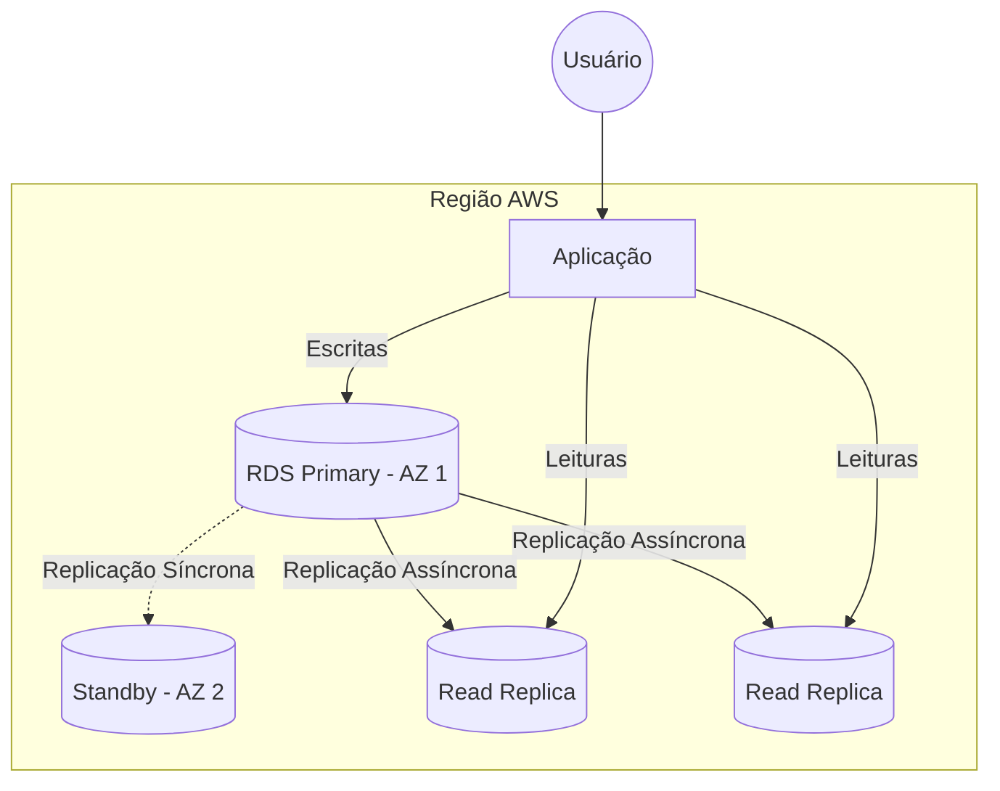

# Amazon RDS: Banco Relacional Gerenciado (SQL)

Banco de dados é o coração de muitas aplicações. Só que manter um banco funcionando em produção dá trabalho: instalar o motor, aplicar patches, fazer backup, monitorar disponibilidade e torcer para nunca precisar restaurar tudo às três da manhã.

É justamente esse trabalho operacional que o **Amazon RDS (Relational Database Service)** elimina.

Em vez de administrar a infraestrutura do banco, você passa a focar na aplicação e nos dados, enquanto a AWS cuida das tarefas repetitivas.

---

## 1. O que é o Amazon RDS?

O **Amazon RDS** é um serviço de **banco de dados relacional gerenciado (PaaS)**.

Em outras palavras:

- Você escolhe o motor do banco.
- A AWS provisiona a infraestrutura.
- A AWS cuida de boa parte da administração.

Entre as tarefas automatizadas estão:

- Provisionamento da instância.
- Aplicação de patches.
- Backups automáticos.
- Monitoramento.
- Recuperação após falhas.
- Failover (quando configurado com Multi-AZ).

> **Importante:** Você administra o banco de dados, mas **não** o sistema operacional onde ele está instalado.

---

## 2. Motores (Engines) Suportados

O RDS não é um banco de dados novo.

Ele é um serviço que hospeda vários mecanismos de banco já conhecidos pelo mercado.

| Categoria | Motores |
| :--- | :--- |
| **Open Source** | MySQL, PostgreSQL e MariaDB |
| **Comerciais** | Oracle e Microsoft SQL Server |
| **Cloud-Native** | Amazon Aurora |

### Amazon Aurora

O **Amazon Aurora** merece atenção especial.

Ele foi desenvolvido pela própria AWS e é compatível com:

- MySQL
- PostgreSQL

Na prática, ele entrega maior desempenho e maior disponibilidade quando comparado aos bancos tradicionais compatíveis.

> **Pegadinha de prova:** Aurora **não é um serviço separado do RDS**. Ele é um dos motores disponíveis dentro do Amazon RDS.

---

# 3. Multi-AZ vs. Read Replicas (A Pegadinha Favorita da CLF-C02)

Se existe um assunto que aparece com frequência na prova, é este.

A banca quer saber se você consegue diferenciar:

- **Alta disponibilidade**
- **Escalabilidade de leitura**

Esses conceitos parecem parecidos, mas resolvem problemas completamente diferentes.

---

## Multi-AZ Deployment

### Objetivo

Garantir **Alta Disponibilidade (High Availability)**.

Imagine que a instância principal do banco fique indisponível porque houve uma falha na Availability Zone.

Com o Multi-AZ:

- A AWS mantém uma instância **Standby** em outra AZ.
- Os dados são replicados **sincronamente**.
- Caso a instância principal falhe, ocorre **Failover Automático**.

O endpoint do banco continua o mesmo.

A aplicação praticamente não percebe a troca.

### Quando usar?

Sempre que o objetivo for:

- Alta disponibilidade.
- Recuperação automática de falhas.
- Continuidade do serviço.

**Não melhora desempenho.**

---

## Read Replicas

### Objetivo

Melhorar a **performance de leitura (Read Scalability)**.

Agora imagine outro cenário.

Seu banco não está caindo.

O problema é outro:

Existem milhares de consultas (`SELECT`) acontecendo ao mesmo tempo.

Nesse caso você cria **Read Replicas**.

Elas recebem cópias dos dados e passam a atender parte das consultas.

Assim:

- A instância principal continua responsável pelas gravações.
- As réplicas atendem as leituras.

### Características

- Replicação **assíncrona**.
- Pode existir pequeno atraso (**Replication Lag**).
- É possível criar várias réplicas.
- Algumas engines permitem réplicas em outras regiões (Cross-Region).

### Quando usar?

Quando o problema é:

- excesso de consultas;
- gargalo de leitura;
- necessidade de escalar a aplicação.

**Não substitui Multi-AZ.**

---

## Comparação Rápida

| Característica | Multi-AZ | Read Replica |
| :--- | :---: | :---: |
| Objetivo | Alta disponibilidade | Escalar leitura |
| Replicação | Síncrona | Assíncrona |
| Failover automático | ✅ Sim | ❌ Não |
| Melhora performance | ❌ Não | ✅ Sim |
| Instância Standby recebe consultas | ❌ Não | ✅ Sim |
| Pode existir em outra região | ❌ Não | ✅ Sim (dependendo da engine) |

> **Essa é uma das pegadinhas favoritas da prova.**
>
> Se o enunciado falar em **falha**, pense em **Multi-AZ**.
>
> Se falar em **lentidão nas consultas**, pense em **Read Replica**.

---

## 4. Como Funciona

---

## 5. Backups e Snapshots

Mesmo sendo um serviço gerenciado, você continua precisando pensar em recuperação de dados.

O RDS oferece dois mecanismos diferentes.

---

### Automated Backups

São os backups automáticos realizados pela AWS.

Eles incluem:

- Backup diário do armazenamento.
- Logs de transação.

Essa combinação permite utilizar o recurso de:

**Point-in-Time Recovery (PITR)**

Ou seja, restaurar o banco para um momento específico dentro do período de retenção.

### Características

- Configuração automática.
- Retenção entre **0 e 35 dias**.
- Permite restaurar para praticamente qualquer instante dentro desse período.

---

### DB Snapshots

Os Snapshots são diferentes.

Eles são criados manualmente.

São indicados quando você deseja preservar permanentemente um estado do banco.

Exemplos:

- Antes de uma grande atualização.
- Antes de alterar o esquema do banco.
- Antes de migrar aplicações.

Ao contrário dos Automated Backups:

- continuam existindo mesmo que a instância RDS seja removida.

> Pense no Snapshot como uma "foto" permanente do banco naquele momento.

---

## 6. Quando Usar Cada Recurso?

| Cenário | Melhor escolha |
| :--- | :--- |
| Aplicação não pode parar | Multi-AZ |
| Muitas consultas (`SELECT`) | Read Replica |
| Restaurar banco para um horário específico | Automated Backups + PITR |
| Guardar uma cópia permanente antes de mudanças importantes | DB Snapshot |

---

## 🎯 Gatilho de Exame

Associe rapidamente cada necessidade ao recurso correto:

- **Banco relacional gerenciado** → **Amazon RDS**
- **Compatível com MySQL e PostgreSQL, desenvolvido pela AWS** → **Amazon Aurora**
- **Alta disponibilidade** → **Multi-AZ**
- **Failover automático** → **Multi-AZ**
- **Replicação síncrona** → **Multi-AZ**
- **Escalar consultas (SELECT)** → **Read Replica**
- **Replicação assíncrona** → **Read Replica**
- **Restaurar para um momento específico** → **Point-in-Time Recovery (PITR)**
- **Backup permanente** → **DB Snapshot**
- **Até 35 dias de retenção** → **Automated Backups**

---

> **⚠️ Sinal de Alerta**
>
> A CLF-C02 adora misturar **Multi-AZ** e **Read Replica**.
>
> Grave esta regra:
>
> - Falou em **alta disponibilidade**, **failover**, **desastre** ou **continuidade do serviço** → **Multi-AZ**.
> - Falou em **lentidão**, **muitas consultas**, **escalar leitura** ou **SELECTs** → **Read Replica**.
>
> Outra pegadinha clássica:
>
> Você **não possui acesso SSH** ao sistema operacional de uma instância RDS. Se o cenário exigir controle total do servidor ou do SO, a solução deixa de ser o RDS e passa a ser um banco instalado em uma **instância Amazon EC2**.

---

### 🧭 Navegação de Conteúdos
* [🏠 Menu Principal](../README.md)
* [⬅️ Módulo 4: Micro-Simulado - Armazenamento e Transferência](../04-armazenamento-e-transferencia/10-micro-simulado-armazenamento.md)
* [➡️ Módulo 5: Amazon Aurora - Performance e Resiliência Nativa](01-aurora-performance-e-resiliencia-nativa.md)

---
---